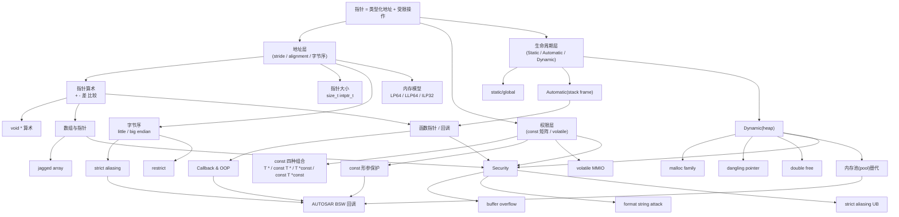
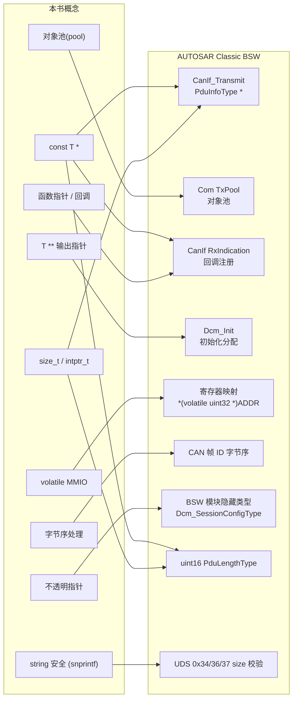
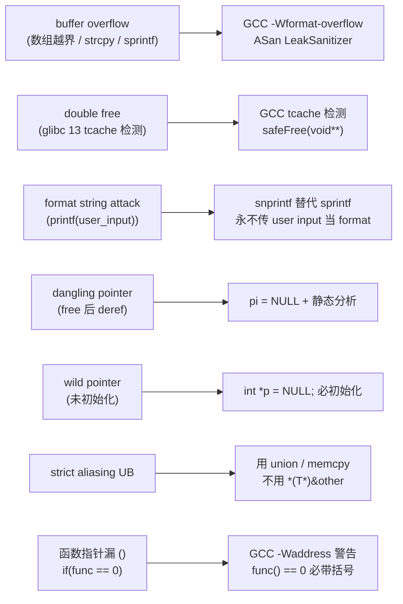

# 知识体系总图

> 本图谱覆盖 Richard Reese，《Understanding and Using C Pointers》全 8 章，以「**概念 → 章节 → 工程映射**」三层组织。
> 用途：翻笔记时快速定位「这个概念在哪章出现、属于哪个域、有什么 Action 可跑」。
> 维护规则：每章写完 / 大改时同步本图谱；跑过的代码归档于 `code-exercises/`。

---

## 1. 概念地图



---

## 2. 章节 × 概念 矩阵

| 概念 | ch1 | ch2 | ch3 | ch4 | ch5 | ch6 | ch7 | ch8 |
| --- | :-: | :-: | :-: | :-: | :-: | :-: | :-: | :-: |
| 三种内存分区 | ✅ | | | | | | | |
| `void *` / `size_t` / `intptr_t` | ✅ | | | | | | | |
| `const` 四种组合矩阵 | ✅ | | ✅ | | ✅ | | ✅ | |
| 指针算术 / 比较 | ✅ | | | ✅ | | ✅ | ✅ | |
| `malloc` / `calloc` / `realloc` / `free` | | ✅ | | | | | ✅ | |
| dangling pointer / double free | | ✅ | | | | | ✅ | |
| 静态内存池(对象池) | | ✅ | | | | ✅ | | |
| 栈帧 / 传址 vs 传值 | | | ✅ | | | | | |
| `T *` / `T **` 形参语义 | | | ✅ | | | ✅ | | |
| 函数指针 / typedef / 回调 | | | ✅ | | ✅ | ✅ | ✅ | ✅ |
| 数组 vs 指针 / sizeof 退化 | | | | ✅ | | | ✅ | |
| 多维数组 / stride / jagged | | | | ✅ | | | | |
| 字符串字面量 / literal pool | | | | | ✅ | | ✅ | |
| `strcpy` / `strcat` / `snprintf` 安全 | | | | | ✅ | | ✅ | |
| 结构体 padding / `->` vs `.` | | | | | | ✅ | | |
| 链表 / 队列 / 栈 / 树 | | | | | | ✅ | | |
| 不透明指针 / 多态 | | | | | | | | ✅ |
| 字节序 / strict aliasing | | | | | | | ✅ | ✅ |
| `restrict` / volatile / DMA | | | | | | | | ✅ |
| threads + mutex + 回调 | | | | | | | | ✅ |

---

## 3. 工程落地映射（NeuSAR / 嵌入式 / 汽车电子）



**映射对照表**(每个概念在 ECU 代码里的具体出现位置):

| 概念 | AUTOSAR / 嵌入式对应 |
| --- | --- |
| `const T *` 形参 | `CanIf_Transmit(PduIdType, const PduInfoType *)`、`Com_RxIndication(PduIdType, const PduInfoType *)` |
| `T **` 形参 | `Dcm_<Service>_Init(SomeHandle **outBuf)` |
| 对象池 | `Com_TxPduCfgType[]`(配置数组) + `Com_TxStateType`(从 pool 取) |
| 函数指针 | `CanIf_RxIndication`、`PduR_RxIndication` 注册表 |
| 不透明指针 | `Dcm_DiagnosticSessionType`、`PduIdType` 模块内部结构体隐藏 |
| `volatile` MMIO | `*(volatile uint32_t *)&TIM2->CR1`(CMSIS) |
| `snprintf` vs `sprintf` | UDS 服务响应格式化(`Dcm_<Service>_FormatResponse`) |
| 字节序 | `CanIf` 字节序处理,PowerPC ECU 上的 byte swap |

---

## 4. 安全攻击 ↔ 章节 ↔ 防御



**关键防御工具链**(按优先级):

1. **ASan** — runtime 拦截 buffer overflow、UAF、leak。
2. **GCC `-Wall -Wextra -Wformat=2 -Wpointer-arith`** — 编译期静态分析。
3. **`clang-tidy --checks=bugprone-*,clang-analyzer-*`** — 更深一层 lint。
4. **MISRA-C:2012** — 工业标准编码规范(每条 ch7 错例都有对应 rule)。
5. **CERT C** — 安全编码标准(与 ch7 完全对应)。
6. **stack cover  / FORTIFY_SOURCE** — 编译期 buffer 检查。

---

## 5. LLM 时代陷阱速查

LLM 写 C 代码高频错的「ch 对应」:

| LLM 错例 | 书中对应章节 | 防御提示工程 |
| --- | --- | --- |
| `int* a, b;` 链式声明 | ch1 + ch7 | prompt: 「每个变量前都加 `*`」 |
| `*p = malloc(...);` deref | ch1 + ch2 | prompt: 「`pi = malloc(...)`,不要 deref malloc 返回」 |
| `if (func() == 0)` 漏 `()` | ch3 + ch7 | prompt: 「调用函数必须有 `()`」 |
| `char *p = "..."; *p = 'x';` | ch5 + ch7 | prompt: 「字符串字面量用 `const char *`」 |
| `printf(buf)` user input 当 format | ch5 + ch7 | prompt：「user input 永远作 `%s` 参数，不当 format」 |
| BST insertNode 用 `TreeNode *` 而非 `**` | ch6 | prompt: 「BST 插入需要 `TreeNode **` 形参」 |
| `sprintf(buf, ...)` 无 size | ch5 + ch7 | prompt: 「用 `snprintf` 替代」 |
| 重复 `free(p)` | ch2 + ch7 | prompt: 「`free` 后立即 `p = NULL`」 |

---

## 6. Action 复盘索引(可跑的实验)

| ch | Action 文件 | 验证结论 |
| --- | --- | --- |
| 1 | `code-exercises/ch01_misuse.c` | size_t `%zu` 在 LP64 下输出 `18446744073709551611` |
| 2 | `code-exercises/ch02_saferfree.c` | glibc 13 tcache 检测 double-free;`safeFree` 第二次调用 OK |
| 2 | `code-exercises/ch02_realloc_resize.c` | shrink 复用;grow 搬移;`realloc(p, 0)` → NULL |
| 3 | `code-exercises/ch03_dangling_local.c` | 返回局部 VLA → GCC 警告 + segv |
| 3 | `code-exercises/ch03_ptr_to_ptr.c` | `T *` 改不了 caller,`T **` 改得了 |
| 4 | `code-exercises/ch04_array_vs_ptr.c` | `sizeof(vector)=20`、`sizeof(pv)=8`、`sizeof(arr in func)=8` |
| 4 | `code-exercises/ch04_2d_stride.c` | `matrix+1` 跳 20 字节,`&matrix[0][0]+1` 跳 4 字节 |
| 5 | `code-exercises/ch05_literal_pool.c` | 三个 `"hello world"` 同址;`*p='L'` → SIGSEGV |
| 5 | `code-exercises/ch05_strcmp_eq.c` | `command == "Quit"` 永为 false |
| 5 | `code-exercises/ch05_snprintf_overflow.c` | GCC `-Wformat-overflow=` 编译期拦截 |
| 6 | `code-exercises/ch06_struct_leak.c` + ASan | LeakSanitizer 抓 24 字节 3 个泄漏 |
| 6 | `code-exercises/ch06_tree_root.c` | BST `TreeNode*` 失败;`TreeNode**` 成功 |
| 6 | `code-exercises/ch06_linkedlist.c` | addHead + delete 完整 demo |
| 7 | `code-exercises/ch07_deref_misuse.c` | `*pbad = num` 在本机栈布局下未 segv |
| 7 | `code-exercises/ch07_sizeof_misuse.c` | GCC stack protector `*** stack smashing detected ***` |
| 7 | `code-exercises/ch07_fptr_paren.c` | GCC `-Waddress` 两条警告 |
| 8 | `code-exercises/ch08_endian.c` | x86-64 little-endian |
| 8 | `code-exercises/ch08_union_pun.c` | `3.14f` IEEE 754 = `0x4048f5c3` |
| 8 | `code-exercises/ch08_opaque.c` | 不透明指针封装 LinkedList |

---

## 7. 复现脚本

```bash
cd /home/liyahong/dev/read/notes/understanding-using-c-pointers/code-exercises

# 一键 build + run(全 19 个 .c)
for c in *.c; do
    bin="${c%.c}"
    gcc -O0 -g -Wall -Wextra -o "$bin" "$c" \
        && echo "=== $bin ===" && timeout 5 "./$bin" \
        || echo "[BUILD FAIL] $c"
done

# ASan 版 ch06(struct leak)
gcc -O0 -g -Wall -Wextra -fsanitize=address \
    -o ch06_struct_leak_asan ch06_struct_leak.c
ASAN_OPTIONS=detect:leaks=1 ./ch06_struct_leak_asan
```

---

## 8. 阅读路线推荐

按你的角色挑入口:

- **第一次读这本书**:ch1 → ch2 → ch3 → ch7 → ch6 → ch4 → ch5 → ch8
- **重点安全**:ch2 → ch7(全部)+ ASan + clang-tidy
- **嵌入式寄存器 / MMIO**:ch1 → ch8 → Action
- **数据结构 / 链表**:ch6(全部)+ ch3 函数指针
- **AUTOSAR 集成**:ch1 const → ch3 回调 → ch6 对象池 → ch7 安全

---

> 维护提示：本图谱随每章笔记同步更新。每章落档后，检查本文件中的章节矩阵与新增概念是否仍准确。