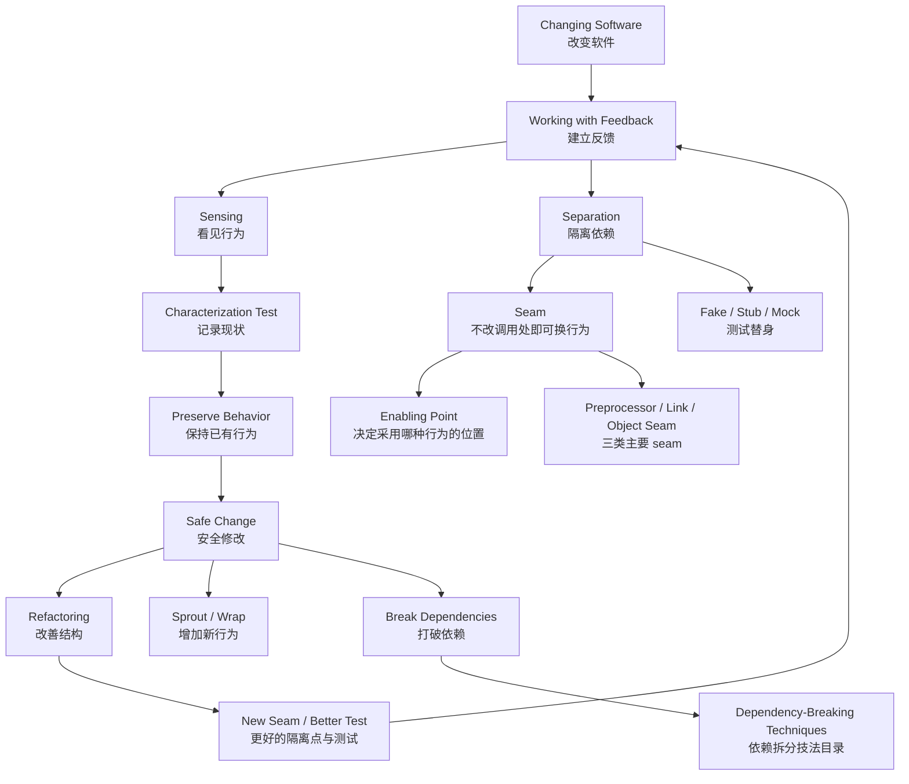
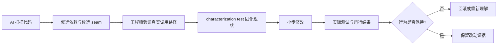

# Working Effectively with Legacy Code — Knowledge Graph

> 本图谱只整理本书内部的概念、技法和章节关系，不与其他书的笔记交叉引用。

## 1. 一句话总图

遗留代码的问题不是“代码旧”，而是**改动风险不可见、反馈周期太长、依赖关系无法隔离**。本书的主线是：

> **先建立反馈 → 再看见行为 → 把行为与依赖分开 → 在安全反馈下逐步改变结构。**

## 2. 核心概念图



## 3. 概念节点与关系

| 节点 | 它回答的问题 | 连接到 | 关系说明 |
|---|---|---|---|
| 改变软件 | 我到底要改变什么？ | 结构、功能、资源使用 | 任何修改至少影响其中一种目标 |
| 反馈 | 我怎么知道改动有没有造成问题？ | 测试、编译、运行结果 | 反馈越快，允许的改动步子越小、越安全 |
| 测试覆盖 | 哪些行为已经被保护？ | 反馈、感知 | 没有覆盖的行为不能靠直觉宣称安全 |
| 感知 | 怎样观察代码当前到底做了什么？ | 输出、状态、调用记录 | 先观察，再判断是否应该改变 |
| 分离 | 怎样让目标代码脱离数据库、文件、网络等依赖？ | fake、mock、seam | 把“要测试的逻辑”和“难以控制的环境”拆开 |
| Seam | 不修改所在位置，怎样替换它使用的行为？ | enabling point、依赖拆分 | seam 是可替换的位置，不等于接口或抽象类 |
| Enabling point | 测试行为在哪里被选中？ | 构造点、宏、链接配置 | 它决定测试版本还是生产版本被采用 |
| Characterization test | 既没有规格，怎样记录现有行为？ | sensing、保持行为 | 断言记录“现在是什么”，不是臆测“应该是什么” |
| Unit test | 怎样获得快速、局部、可定位的反馈？ | 分离、替身 | 单元测试的价值来自反馈质量，不只是测试数量 |
| Refactoring | 怎样改善结构而不改变行为？ | 测试、seam、反馈 | 重构必须由反馈保护，而不是由代码风格证明 |
| Fake / Stub / Mock | 怎样在测试中替代真实依赖？ | 分离、行为验证 | fake 提供可运行替代，stub 提供间接输入，mock 验证调用行为 |
| Sprout / Wrap | 没法安全改老代码时，怎样增加功能？ | 增量改变、保持旧行为 | 把新逻辑放到新方法或包装层，先不碰旧路径 |
| Dependency breaking | 怎样让代码可测试？ | seam、构造点、全局引用 | 先打破阻碍测试的依赖，再建立测试 |
| Monster method | 一个巨大方法无法测试，怎样开始？ | sensing、提取、局部反馈 | 先找可观察的片段，再逐步抽取，不追求一次重写 |
| 责任边界 | 代码为什么总在多个地方重复修改？ | 结构、类、方法 | 通过移动责任减少变化扩散 |
| 行为保持 | 怎样避免“重构”偷偷改变业务语义？ | characterization test、回归测试 | 改善实现不等于改变对外可见行为 |

## 4. 章节到概念的映射

| 章节 | 主要节点 | 在图谱中的作用 |
|---|---|---|
| Ch01 Changing Software | 改变软件、结构、功能、资源 | 定义“修改”这件事的基本分类 |
| Ch02 Working with Feedback | 反馈、测试覆盖、Software Vise | 说明为什么反馈是安全修改的前提 |
| Ch03 Sensing and Separation | 感知、分离、fake、mock | 把“看见行为”和“隔离依赖”区分开 |
| Ch04 The Seam Model | seam、enabling point | 给出替换遗留依赖的统一模型 |
| Ch05 Tools | 重构工具、测试框架、mock 工具 | 说明工具如何缩短反馈回路 |
| Ch06 I Don't Have Much Time and I Have to Change It | Sprout、Wrap、增量改变 | 时间紧时先增加新行为而不扰动旧代码 |
| Ch07 It Takes Forever to Make a Change | 构建反馈、局部化测试 | 处理编译、部署和验证过慢的问题 |
| Ch08 How Do I Add a Feature? | 新功能、Sprout、Wrap | 在旧代码旁边安全地长出新代码 |
| Ch09 I Can't Get This Class into a Test Harness | 构造依赖、测试入口 | 处理类无法进入测试环境的问题 |
| Ch10 I Can't Run This Method | 方法可见性、间接调用 | 找到方法无法独立运行的原因 |
| Ch11 What Methods Should I Test? | 变化点、测试选择 | 决定哪些方法值得优先保护 |
| Ch12 Many Changes in One Area | 变化聚集、共同责任 | 处理一个区域不断被反复修改的问题 |
| Ch13 What Tests Should I Write? | characterization test | 在没有规格时从现状建立保护网 |
| Ch14 Dependencies on Libraries | 库依赖、替换点 | 隔离难以控制的第三方库 |
| Ch15 All API Calls and No Logic | API 包装、逻辑边界 | 从 API 胶水中找回可测试的业务逻辑 |
| Ch16 I Don't Understand the Code | 探索、实验性测试 | 用小实验代替一次性读懂全部代码 |
| Ch17 My Application Has No Structure | 结构、责任、架构知识 | 在无结构系统中建立可导航的边界 |
| Ch18 My Test Code Is in the Way | 测试维护、测试设计 | 防止测试本身成为继续修改的障碍 |
| Ch19 Not Object-Oriented | 过程式代码、全局状态 | 不依赖面向对象也能建立安全修改路径 |
| Ch20 This Class Is Too Big | 大类、责任拆分 | 控制类继续膨胀，逐步移动责任 |
| Ch21 Changing the Same Code All Over | 重复变化、变化点 | 把分散的同类变化集中到合理边界 |
| Ch22 Monster Method | 巨型方法、sensing、抽取 | 在最难测试的局部开始建立结构 |
| Ch23 Not Breaking Anything | 行为保持、回归风险 | 给所有技法加上“如何证明没破坏”的纪律 |
| Ch24 Overwhelmed | 团队反馈、持续改进 | 处理长期遗留代码工作的心理和组织成本 |
| Ch25 Dependency-Breaking Techniques | 技法目录、依赖拆分 | 按症状反查具体的依赖打破方法 |

## 5. 三条阅读路径

### 路径 A：第一次接手遗留系统

`Ch01 → Ch02 → Ch03 → Ch04 → Ch13 → Ch23`

先理解改变和反馈，再学习观察行为、隔离依赖、记录现状，最后确认如何防止回归。

### 路径 B：今天就要改一个危险模块

`Ch06 → Ch08 → Ch09/Ch10 → Ch11 → Ch25`

先用 Sprout 或 Wrap 控制改动范围，再解决测试入口，最后按症状查依赖拆分技法。

### 路径 C：长期治理结构问题

`Ch07 → Ch12 → Ch15 → Ch17 → Ch20 → Ch21 → Ch22 → Ch24`

从反馈速度开始，逐步处理 API 胶水、无结构、大类、重复变化、巨型方法和团队疲劳。

## 6. 依赖拆分的决策顺序

```text
1. 我能观察到要保护的行为吗？
   否 → 先做 sensing 或 characterization test

2. 我能在本地、快速地运行它吗？
   否 → 找出数据库、文件、网络、库或全局状态依赖

3. 依赖能否在不改调用处的情况下替换？
   能 → 找 seam 与 enabling point
   不能 → 选择 dependency-breaking technique

4. 替身应该提供数据，还是验证调用？
   提供数据 → fake / stub
   验证调用 → mock

5. 改动后行为是否仍然一致？
   不确定 → 补 characterization / regression test
   已确认 → 才继续下一小步重构
```

## 7. 工程落地的最小闭环

```text
一个具体改动
  ↓
找到可观察行为
  ↓
建立最小反馈
  ↓
隔离一个最碍事的依赖
  ↓
做一小步改变
  ↓
编译、测试、比较结果
  ↓
保留行为证据
  ↓
再做下一小步
```

在 Linux 系统或机器人软件中，这个闭环通常意味着：先把文件、socket、时间、线程、硬件驱动或中间件调用变成可控制的边界；不要一开始就重写整个节点、服务或进程。

## 8. AI 辅助理解的边界



AI 可以帮助列出调用关系、识别全局状态、生成测试骨架和提出可能的 seam；但它不能仅凭代码判断业务行为是否允许改变，也不能把“代码看起来更干净”当成行为等价。真正的证据仍然来自运行结果、测试覆盖和熟悉系统的工程师判断。
